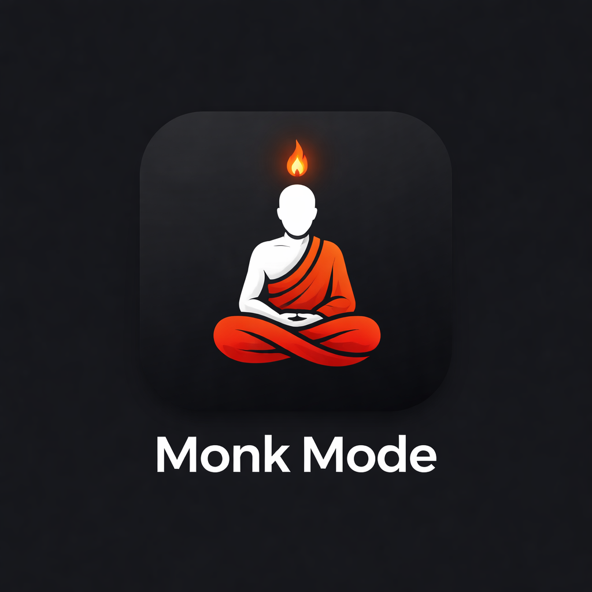

<div align="center">



# 🧘 Monk Mode

### *A home screen that fights back.*

**Not a productivity app. A discipline system.**

[](https://flutter.dev)
[](https://developer.android.com)
[](#-the-launcher)
[](LICENSE)

[**Install**](#-quick-start) · [**Features**](#-features) · [**Tech**](#-tech)

</div>

---

## 🎯 The Problem

> You open Instagram for *"just 5 minutes"*.
> You resurface 47 minutes later.
> You hate it. You do it anyway.

## 💡 The Fix

Monk Mode **replaces your home screen** and drags every distraction through a 4-step friction gauntlet before it opens. Not a blocker — a *mirror*. Most urges die in 10 seconds of forced pause.

---

## ⚡ Features

### 🏠 The Launcher
- 🕐 **Minimal home** — clock, date, streak pill. That's it.
- 📌 **3-slot dock** — pin your only three must-haves. Long-press to unpin.
- 👆 **Swipe up** → full app drawer with search
- 🎨 **Wallpaper modes** — Stylized / Dimmed / Blurred / **Custom from gallery** / Pure Black
- 🌑 **Dim slider** — 0–85% overlay, for when even your wallpaper is too loud
- 🔒 **Default launcher** — press Home, land in silence

### 🔥 The Gauntlet
Four screens stand between you and every locked app:

| # | Screen | What happens |
|---|---|---|
| 1 | **Why Are You Here?** | Pick your honest reason — Habit / Bored / Escape / Real Need |
| 2 | **Regret Mirror** | Your real stats. Hours lost. Times opened. No fiction. |
| 3 | **Pain Confirmation** | *"Every tap trains weakness."* Stay Strong, or relent. |
| 4 | **10-Second Countdown** | Forced pause. Urges fade when not fed. |

### 🎖 Discipline Engine
- 🗄 **Vault** — every locked app in one place
- 📈 **Real usage tracking** — UsageStatsManager + AccessibilityService, no guesses
- 🔥 **Streaks with midnight rollover** — honest, unforgiving
- 🟢🟡🔴 **Daily score** — Monk / Slipping / Lost, earned per day
- 🚨 **Emergency Pass** — 3 lifetime. Ever. No refills.
- 📊 **Weekly chart** — resisted vs opened, per day

---

## 🛡 How the Lock Works

```
┌──────────────────┐        ┌──────────────────────┐
│ You tap Instagram│──────▶ │ AccessibilityService │
└──────────────────┘        │   sees window open   │
                            └──────────┬───────────┘
                                       ▼
                            ┌──────────────────────┐
                            │ InterceptActivity    │
                            │  launches Flutter    │
                            │  into the gauntlet   │
                            └──────────────────────┘
```

**Zero telemetry.** Every byte stays on-device.

### 🔐 Permissions

| | Permission | Why |
|---|---|---|
| 🏠 | **Default Launcher** | Home-button lands here, not Instagram |
| ♿ | **Accessibility** | Catches locked apps the split-second they open |
| 📊 | **Usage Stats** | Feeds the Regret Mirror real numbers |
| 🔋 | **Battery Optimization** | Keeps the guard alive when Android wants to sleep it |

---

## 📉 Impact

> **10 seconds of pause can save 1 hour of scrolling.**

- Every resisted urge = one more brick in your streak
- Every Regret Mirror = one more confrontation with the cost
- Every pinned-dock edit = one more app that stopped owning you

This app is **intentionally painful**. That's the feature.

---

## 🧰 Tech

| | | |
|---|---|---|
| **UI** | Flutter 3.41 · Dart | 📱 |
| **State** | Riverpod (StateNotifier) | 🌊 |
| **Routing** | GoRouter | 🧭 |
| **Storage** | SharedPreferences | 💾 |
| **Charts** | fl_chart | 📊 |
| **Native** | Kotlin · MethodChannel | 🤖 |
| **Services** | AccessibilityService · UsageStats · BootReceiver | ⚙️ |
| **FX** | BackdropFilter · ImageFilter.blur | ✨ |

**Architecture:** Clean · data / providers / presentation — zero codegen, zero magic.

---

## 🚀 Quick Start

```bash
git clone https://github.com/codecravings/monk-mode.git
cd monk-mode
flutter pub get
flutter build apk --release
flutter install
```

**First launch:**
1. 🏠 Set Monk Mode as default launcher
2. ♿ Enable Accessibility → *Monk Mode Guard*
3. 📊 Allow Usage Stats
4. 🔋 Ignore Battery Optimization
5. 🗄 Open **Vault** → lock your distractions
6. 📌 **Edit Dock** → pin your 3 essentials
7. 🏠 Press Home. Welcome to Monk Mode.

> ⚠️ Requires a **physical Android device**. Emulators can't test accessibility services or default launcher behaviour.

---

## 🗂 Project Structure

```
lib/
├── core/           → theme · router · constants
├── data/           → models · storage · AndroidBridge · WallpaperService
└── presentation/
    ├── providers/  → apps · stats · settings · permissions
    ├── screens/    → launcher_home · vault · dock_picker · app_drawer
    │                 settings · dashboard · onboarding · access_flow/*
    └── widgets/    → StreakCard · StatCard · UsageChart

android/app/src/main/kotlin/com/monkmode/monk_mode/
├── MainActivity.kt              → launcher intent filters + bridge
├── MonkModeAccessibilityService → window-state interceptor
├── InterceptActivity            → trampoline into Flutter gauntlet
├── UsageStatsBridge             → real session data
└── BootReceiver                 → survives reboot / reinstall
```

---

## 🧠 Philosophy

Most apps try to make discipline **easy**.
Monk Mode makes distraction **harder**.

The friction is the feature.
The pause is the point.
The mirror is the mercy.

Your home screen is the first thing you see a hundred times a day.
If it's a wall of dopamine, you've lost before you opened your eyes.
If it's a clock, a streak, and three honest apps — you stand a chance.

---

<div align="center">

### ⭐ **[github.com/codecravings/monk-mode](https://github.com/codecravings/monk-mode)**

*Built with focus, by someone who also struggles with distraction.*

**[@codecravings](https://github.com/codecravings)** · MIT License

</div>
